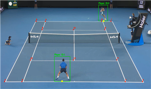
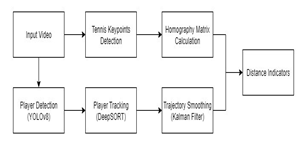

# Tennis Player Tracking and Distance Measurement

[](https://doi.org/10.9708/jksci.2025.30.11.125)
[](https://www.python.org/)
[](LICENSE)

<p align="center">
  
</p>

단일 고정 카메라로 촬영한 테니스 경기 영상에서 선수를 탐지·추적하고, 영상 좌표를 실제 코트 좌표로 변환하여 선수별 이동 거리와 움직임 통계를 산출하는 컴퓨터 비전 파이프라인입니다.

본 저장소는 다음 논문에서 제안한 방법의 구현을 포함합니다.

> **Tennis Player Tracking and Distance Measurement Using DeepSORT and Homography**  
> Hyun-Il Kim and Seung-Bo Park, *Journal of the Korea Society of Computer and Information*, 2025.

## 주요 기능

- 커스텀 YOLO 모델을 이용한 테니스 선수 탐지
- DeepSORT 기반 선수 ID 추적
- ResNet-50 기반 테니스 코트 특징점 14개 검출
- 호모그래피를 이용한 픽셀 좌표의 실제 코트 좌표 변환
- 칼만 필터 기반 궤적 안정화
- 선수별 이동 거리, 최고 속도 및 평균 속도 표시
- 미니 코트 궤적, 위치 히트맵 및 이동 방향 히스토그램 생성

## 파이프라인

<p align="center">
  
</p>

선수 위치는 바운딩 박스 하단 중앙점으로 정의합니다. 첫 프레임에서 검출한 코트 네 모서리와 복식 코트 규격(10.97 m × 23.77 m)을 이용해 호모그래피 행렬을 계산합니다.

## 실험 결과

논문에서는 고정 시점의 남자 단식 경기 영상 4개에 포함된 선수 8명을 평가했습니다. Kinovea를 이용한 수동 측정값을 기준으로 평균 85.26%의 이동 거리 측정 정확도를 기록했습니다.

| 선수 | Kinovea | 제안 시스템 | 정확도 |
| --- | ---: | ---: | ---: |
| Taylor Fritz | 690.99 m | 801.77 m | 83.96% |
| Andrey Rublev | 676.00 m | 733.09 m | 91.55% |
| Rafael Nadal | 588.35 m | 667.75 m | 86.50% |
| Alexander Zverev | 534.82 m | 626.00 m | 82.95% |
| Novak Djokovic | 613.54 m | 734.15 m | 80.34% |
| Carlos Alcaraz | 637.07 m | 768.62 m | 79.35% |
| Ben Shelton | 624.11 m | 686.14 m | 90.06% |
| Karen Khachanov | 625.52 m | 704.51 m | 87.37% |

실험은 Windows 10과 NVIDIA GeForce GTX 1660 SUPER 환경에서 수행했으며, 약 5분 길이의 영상 한 편을 분석하는 데 평균 11분이 소요되었습니다. 다만 현재 `src/tracking.py`는 YOLO 추론 장치를 `device='cpu'`로 고정하므로, 저장소의 현재 코드를 그대로 실행한 처리 시간은 논문의 GPU 실험 환경과 다를 수 있습니다.

## 저장소 구조

```text
Tennis-Player-Tracking/
├── court_configurations/      # 코트 설정 및 참조 이미지
├── src/
│   ├── main.py                # 전체 분석 파이프라인
│   ├── tracking.py            # YOLO + DeepSORT 추적
│   ├── court_line_detector.py # 코트 특징점 검출
│   ├── homography_manager.py  # 실제 좌표 변환
│   ├── heatmap.py             # 위치 히트맵 생성
│   ├── make_histogram.py      # 이동 방향 히스토그램
│   └── utils/
├── weights/
│   ├── best.pt                # 선수 탐지 모델
│   └── keypoints_model_50.pth # 별도 준비 필요
├── requirements.txt
├── LICENSE
└── README.md
```

> `keypoints_model_50.pth`는 현재 저장소에 포함되어 있지 않습니다. 아래 준비 절차에 따라 별도로 내려받아야 합니다.

## 설치

```bash
git clone https://github.com/akadjsam/Tennis-Player-Tracking.git
cd Tennis-Player-Tracking

python -m venv .venv
```

가상환경을 활성화합니다.

```bash
# Windows
.venv\Scripts\activate

# macOS / Linux
source .venv/bin/activate
```

의존성을 설치합니다.

```bash
python -m pip install --upgrade pip
pip install -r requirements.txt
```

주요 의존성은 PyTorch, torchvision, Ultralytics, OpenCV, Deep SORT Realtime, NumPy, pykalman, Matplotlib입니다.

## 모델 준비

선수 탐지 가중치 `weights/best.pt`는 저장소에 포함되어 있습니다. ([출처](https://github.com/uomoy/tennis-tracking/tree/main/YOLOv8-ByteTrack/weights))

코트 특징점 모델은 참조 프로젝트에서 내려받은 후 다음 경로와 이름으로 배치합니다.

- [해당 깃허브 링크 참조](https://github.com/abdullahtarek/tennis_analysis)

```text
weights/keypoints_model_50.pth
```

다운로드한 파일명이 다른 경우 `keypoints_model_50.pth`로 변경하거나 실행 시 `--court_model`에 실제 경로를 지정하십시오.

## 입력 영상 조건

현재 구현은 다음 조건의 영상에 적합합니다.

- 카메라가 움직이지 않는 고정 시점 영상
- 첫 프레임에서 코트 네 모서리가 모두 명확히 보이는 영상
- 두 선수가 동시에 검출되는 단식 경기 영상
- 코트 전체가 보이는 후방 또는 전방 시점 영상

카메라 이동, 코트 일부 가림, 심한 모션 블러, 선수 폐색 또는 잘못된 코트 특징점 검출은 거리 오차와 ID 전환을 유발할 수 있습니다.

## 실행

기본 경로가 `src/` 디렉터리를 기준으로 작성되어 있으므로 다음과 같이 실행하는 것을 권장합니다.

```bash
cd src

python main.py \
  --input_path ../testvideo/input.mp4 \
  --tracker_model ../weights/best.pt \
  --court_model ../weights/keypoints_model_50.pth \
  --name experiment_01
```

Windows PowerShell에서는 한 줄로 실행할 수 있습니다.

```powershell
python main.py --input_path ../testvideo/input.mp4 --tracker_model ../weights/best.pt --court_model ../weights/keypoints_model_50.pth --name experiment_01
```

### 인자

| 인자 | 설명 | 기본값 |
| --- | --- | --- |
| `--input_path` | 입력 경기 영상 경로 | 코드 내 예제 AVI 경로 |
| `--tracker_model` | YOLO 선수 탐지 가중치 경로 | `../weights/best.pt` |
| `--court_model` | 코트 특징점 모델 경로 | `../weights/keypoints_model_50.pth` |
| `--name` | 출력 파일명에 사용할 실험 이름 | `result` |

## 출력

정상적으로 실행되면 다음 파일이 생성됩니다.

```text
testoutput/
├── experiment_01.mp4
└── heatmap/
    ├── experiment_01_heatmap_player_1.png
    ├── experiment_01_heatmap_player_2.png
    ├── experiment_01_direction_histogram_player_1.png
    └── experiment_01_direction_histogram_player_2.png
```

분석 영상에는 선수 바운딩 박스, 추적 ID, 추정 발 위치, 미니 코트 위치, 누적 이동 거리, 최고 속도 및 평균 속도가 표시됩니다.

## 논문과 현재 구현의 차이

- 논문의 실험 환경에는 GPU가 명시되어 있지만, 현재 `src/tracking.py`의 YOLO 추론은 CPU로 고정되어 있습니다.
- 논문 조건에 맞춰 비교 실험을 수행할 경우 위 항목을 먼저 일치시키는 것을 권장합니다.

## 한계

- 선수의 발 위치를 바운딩 박스 하단 중앙점으로 근사하므로 자세 변화에 민감합니다.
- 카메라가 움직이면 첫 프레임에서 계산한 호모그래피가 이후 프레임에 유효하지 않을 수 있습니다.
- 두 선수가 모두 검출된 프레임에서만 위치와 거리 통계를 갱신합니다.
- 코트 특징점 또는 선수 검출 오차가 누적 이동 거리를 과대 추정할 수 있습니다.

## Citation

이 연구 또는 코드를 활용한 경우 다음 논문을 인용해 주세요.

### BibTeX

```bibtex
@article{kim2025tennis,
  author  = {Hyun-Il Kim and Seung-Bo Park},
  title   = {Tennis Player Tracking and Distance Measurement Using DeepSORT and Homography},
  journal = {Journal of the Korea Society of Computer and Information},
  volume  = {30},
  number  = {11},
  pages   = {125--131},
  year    = {2025},
  doi     = {10.9708/jksci.2025.30.11.125}
}
```

### APA

Kim, H.-I., & Park, S.-B. (2025). Tennis player tracking and distance measurement using DeepSORT and homography. *Journal of the Korea Society of Computer and Information, 30*(11), 125-131. https://doi.org/10.9708/jksci.2025.30.11.125

### IEEE

H.-I. Kim and S.-B. Park, “Tennis Player Tracking and Distance Measurement Using DeepSORT and Homography,” *Journal of the Korea Society of Computer and Information*, vol. 30, no. 11, pp. 125-131, 2025, doi: 10.9708/jksci.2025.30.11.125.

## 참고 프로젝트

이 저장소는 다음 공개 프로젝트를 참고했습니다.

- [abdullahtarek/tennis_analysis](https://github.com/abdullahtarek/tennis_analysis)
- [uomoy/tennis-tracking](https://github.com/uomoy/tennis-tracking)

## License

이 프로젝트는 [MIT License](LICENSE)를 따릅니다.
